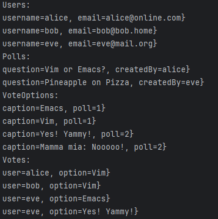

    technical problems that you encountered during installation and use of Java Persistence Architecture (JPA) and how you resolved
    a link to your code for experiment 2 above. Make sure the included test case passes!
    an explanation of how you inspected the database tables and what tables were created. For the latter, you may provide screenshots.
    any pending issues with this assignment that you did not manage to solve

## 1)
# got no problems regarding the installation
# got a lot of errors at the beginning, but after implementation and refactoring of names it worked.
# User class had to be renamed.

## 2) link to code
# https://github.com/Draggard11/experiment-assignment-HVL/commit/28f2105d8c3bba752c819165ce2fed90b4bb4999

## 3)
# used the Persistence in intellij to inspect the database tables
# had to create tables for users, polls, pollOptions and votes
# got a lot of output when doing logging
# 

## 4)
# there is a problem regarding JPA integration that shows up in the terminal
